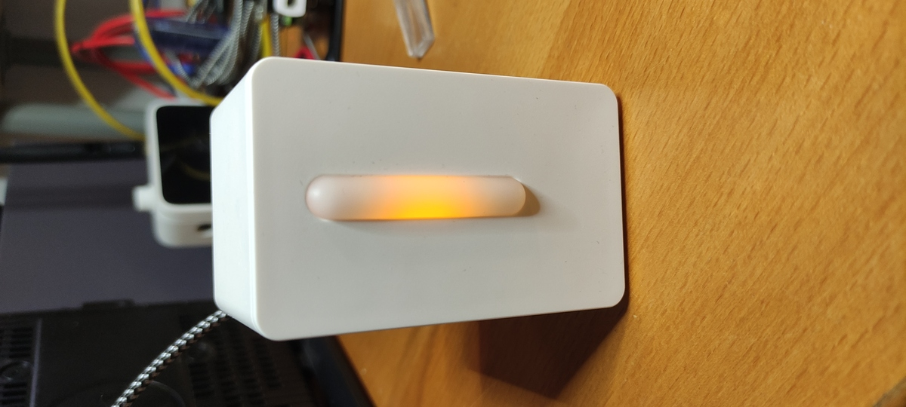
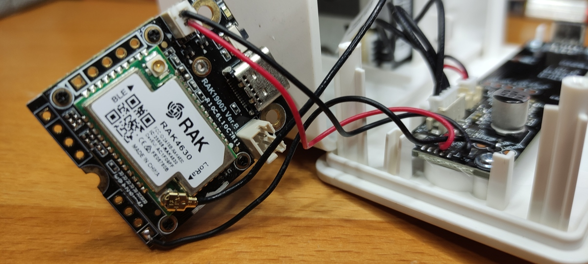
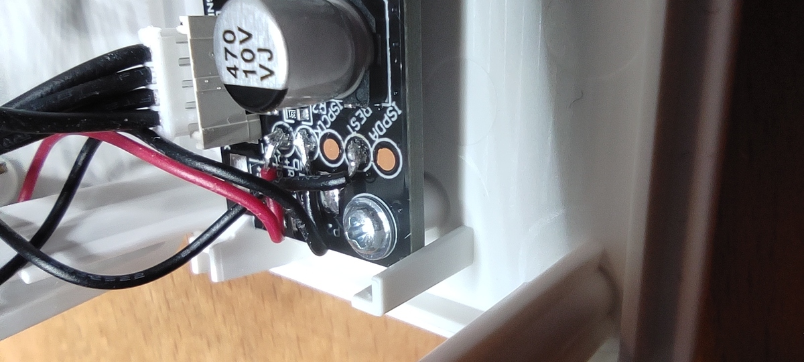
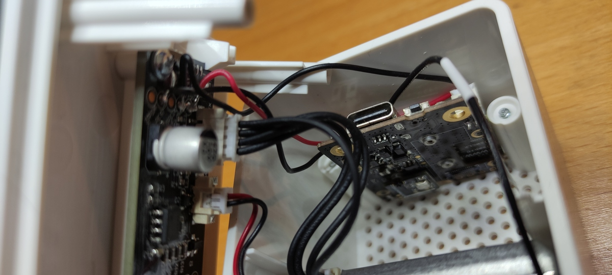

# IKEA Vindriktning WisBlock Hack

This repository holds the code to connect a WisBlock RAK4631 to an IKEA Vindriktning air quality sensor and send the aire quality data over LoRaWAN to your LNS of choice. The code also expects a Bosch BME680 sensor connected to the WisBlock using a WisBlock Environment Sensor (RAK1906).

## Required hardware

These are the components required for this hack:

* IKEA Vindriktning
* RAKwireless WisBlock Mini Base Board (RAK19003)
* RAKwireless nRF52840 Core (RAK4631)
* RAKwireless Environment Sensor (RAK1906)
* A JST1.0 battery connector and some wire
* USB Type-C cable to flash the WisBlock

The whole list is between $60 and $70 at the moment (but you should also consider shipping and customs costs).

## Connecting the hardware

The hack uses the solar panel connector in the WisBlock base to power the WisBlock module from the Vindriktning and the REST pad in the IKEA device to get the readings. Therefore we will need to solder 3 pads to the IKEA Vindriktning PCB:

|Vindriktning|WisBlock base|
|---|---|
|5V|Solar pannel connector using a JST ZHR-2 1.5 mm pitch connector|
|GND|Solar pannel connector using a JST ZHR-2 1.5 mm pitch connector|
|REST|RX1 pin|

Pay special attention to not block the air vents on the enclosure with the WisBlock module. Use double side tape to tape it to the top side of the enclosure with the environment sensor looking downwards.

## Building the firmware

First step is to copy the `config.h.sample` file into `config.h` and edit it. At least you will have to define the credentials for the device after you have provisioned it on your LNS of choice: LORAWAN_DEVEUI, LORAWAN_APPEUI, LORAWAN_APPKEY. You can also change the other settings in the file to match your requirements. Mind the current payload size is 23 bytes. Check the airtime depending on you zone and SF here: https://avbentem.github.io/airtime-calculator/ttn/eu868/23.

The firmware has been prepared to be compiled using PlatformIO (https://platformio.org/), but the WisBlock RAK4631 is not yet supported by default so you will first have to add support for it manually after installing PlatformIO. You can follow the instructions to do so here: https://github.com/RAKWireless/WisBlock/tree/master/PlatformIO.

Once PLatformIO and RAK4631 support installed you will only have to build the firmware (from the VSCore extension or using the command line: `pio run`).

To flash the WisBock connect it to your computer and select build & flash on the IDE or type `pio run -t upload` on the command line.

## Data

The firmware uses CayenneLPP (you can probably enable the CayenneLPP payload formatter in your application server) to encode the data and is configured to send the following data every 5 minutes (default value):

|Magnitude|Channel|Property|Type|Units|
|---|---|---|---|---|
|Temperature|1|temperature_1|float|C|
|Humidity|2|humidity_2|integer|%|
|Pressure|3|barometer_3|float|hPa|
|VOC|4|analog_4|integer|KOhms|
|Average PM2.5|5|analog_5|integer|ug/m3|
|Max PM2.5|6|analog_6|integer|ug/m3|

The IKEA Vindriktning shows green light for PM2.5 values under 30 ug/m3, orange between 30 and 100 ug/m3 and red above that.

## License

Copyright (C) 2022 by Xose Pérez (@xoseperez)

This program is free software: you can redistribute it and/or modify
it under the terms of the GNU General Public License as published by
the Free Software Foundation, either version 3 of the License, or
(at your option) any later version.

This program is distributed in the hope that it will be useful,
but WITHOUT ANY WARRANTY; without even the implied warranty of
MERCHANTABILITY or FITNESS FOR A PARTICULAR PURPOSE.  See the
GNU General Public License for more details.

You should have received a copy of the GNU General Public License
along with this program.  If not, see <http://www.gnu.org/licenses/>.
